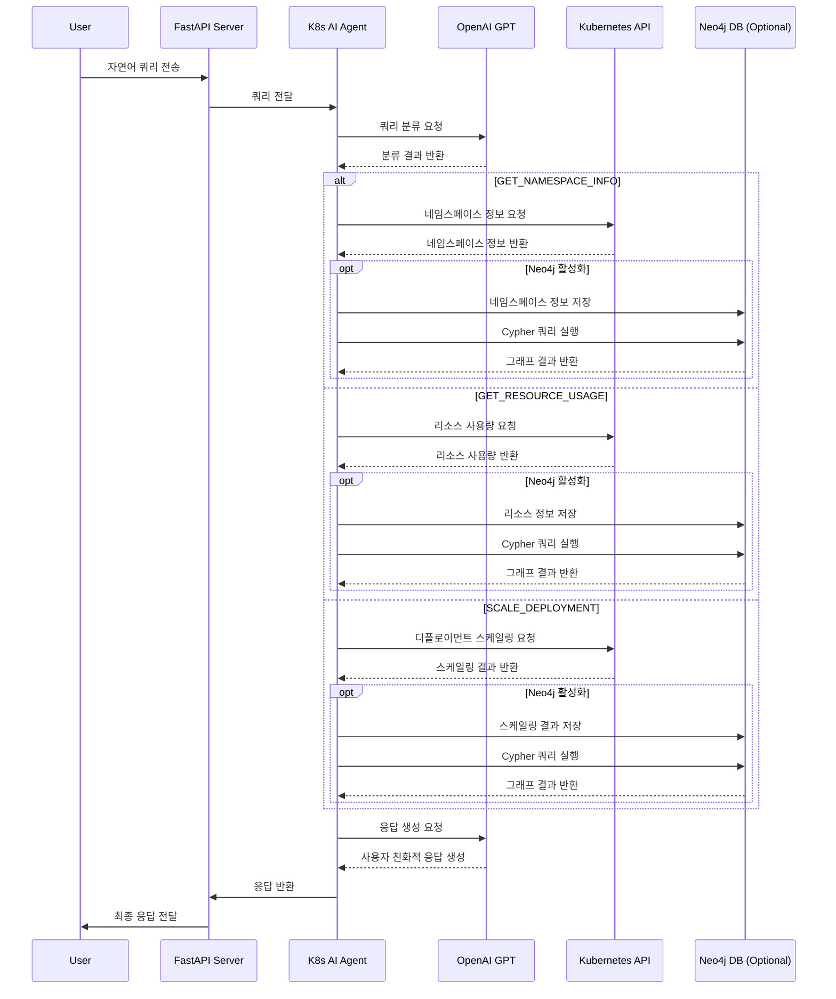

# Kubernetes AI Agent 동작 프로세스

## 개요

Kubernetes AI Agent는 자연어 처리(NLP)를 활용하여 Kubernetes 클러스터를 관리하는 지능형 에이전트입니다. 이 문서는 에이전트의 동작 프로세스와 아키텍처를 설명합니다.

## 아키텍처

시스템은 다음 주요 구성 요소로 이루어져 있습니다:

1. **웹 서버 (app.py)**
   - FastAPI 기반 RESTful API 제공
   - 사용자 쿼리 수신 및 응답 전달
   - 상태 확인 엔드포인트 제공

2. **AI 에이전트 (agent/k8s_agent.py)**
   - 자연어 처리 및 쿼리 분류
   - LangChain 및 OpenAI GPT 모델 활용
   - 대화 컨텍스트 관리

3. **Kubernetes 작업 모듈 (k8s/)**
   - Kubernetes API와 통신
   - 클러스터 리소스 관리 작업 수행

4. **Neo4j 통합 (utils/)**
   - 선택적 그래프 데이터베이스 통합
   - 자연어를 Cypher 쿼리로 변환

## 처리 흐름

Kubernetes AI Agent의 쿼리 처리 흐름은 다음과 같습니다:

## 상세 처리 단계

1. **쿼리 수신 및 분류**
   - 사용자가 `/api/query` 엔드포인트로 자연어 쿼리 전송
   - `K8sAgent.process_query()` 메서드 호출
   - LangChain과 OpenAI 모델을 사용하여 쿼리 분류
   - 분류 카테고리: `GET_NAMESPACE_INFO`, `GET_RESOURCE_USAGE`, `SCALE_DEPLOYMENT`, `UNKNOWN`

2. **파라미터 추출**
   - `_parse_classification()` 메서드가 LLM 응답에서 JSON 구조 파싱
   - 클러스터 이름, 네임스페이스, 디플로이먼트 이름, 스케일 팩터 등 추출

3. **Kubernetes 작업 실행**
   - 분류된 카테고리에 따라 적절한 핸들러 메서드 호출:
     - `_handle_namespace_info()`: 네임스페이스 정보 조회
     - `_handle_resource_usage()`: 리소스 사용량 분석
     - `_handle_scale_deployment()`: 디플로이먼트 스케일링
   - `K8sOperations` 클래스의 메서드를 통해 Kubernetes API와 통신

4. **Neo4j 통합 (선택적)**
   - `USE_NEO4J=true`로 설정된 경우 활성화
   - Kubernetes 정보를 Neo4j 그래프 데이터베이스에 저장
   - `Text2Cypher` 클래스를 사용하여 자연어 쿼리를 Cypher 쿼리로 변환
   - 그래프 데이터베이스에서 정보를 조회하여 결과에 추가

5. **응답 생성**
   - `response_chain`이 작업 결과를 사용하여 사용자 친화적인 응답 생성
   - 대화 컨텍스트가 `ConversationBufferMemory`에 저장
   - 생성된 응답이 API를 통해 사용자에게 반환

## 기술 스택

- **언어 및 프레임워크**
  - Python 3.9
  - FastAPI
  - Uvicorn

- **AI 및 자연어 처리**
  - LangChain
  - OpenAI GPT 모델 (gpt-4o-mini)

- **Kubernetes 통합**
  - Kubernetes Python Client

- **데이터베이스 (선택적)**
  - Neo4j 그래프 데이터베이스

- **배포**
  - Docker
  - Kubernetes

## 환경 변수 설정

| 변수 | 설명 | 기본값 |
|------|------|--------|
| `OPENAI_API_KEY` | OpenAI API 키 (필수) | - |
| `USE_NEO4J` | Neo4j 사용 여부 | `false` |
| `NEO4J_URI` | Neo4j 서버 URI | `bolt://localhost:7687` |
| `NEO4J_USERNAME` | Neo4j 사용자 이름 | `neo4j` |
| `NEO4J_PASSWORD` | Neo4j 비밀번호 | - |
| `KUBECONFIG_PATH` | Kubeconfig 파일 경로 | 기본 kubeconfig |

## 확장성 및 유연성

- **모듈식 설계**: 각 구성 요소가 독립적으로 작동하여 확장 가능
- **Neo4j 선택적 사용**: 환경 변수로 제어되는 선택적 기능
- **오류 처리**: 구성 요소 실패 시 graceful degradation
- **컨테이너화**: Docker 및 Kubernetes 배포 지원

## 결론

Kubernetes AI Agent는 자연어 인터페이스를 통해 Kubernetes 관리를 단순화하고, 필요에 따라 Neo4j 그래프 데이터베이스를 활용하여 복잡한 관계 쿼리를 지원하는 유연한 아키텍처로 설계되었습니다. 이 시스템은 Kubernetes 클러스터 관리를 위한 직관적인 인터페이스를 제공하며, 컨테이너화를 통해 쉽게 배포하고 확장할 수 있습니다.

이 프로젝트는 K-PaaS(Kubernetes Platform as a Service)에서 AIOps(AI for IT Operations)를 지원하기 위한 확장 기능으로 개발되었습니다. K-PaaS 환경에서 운영되는 애플리케이션과 인프라를 보다 효율적으로 관리하고 모니터링하기 위해, 인공지능 기술을 활용하여 운영자의 업무를 자동화하고 의사결정을 지원합니다. 이를 통해 K-PaaS 사용자는 복잡한 Kubernetes 명령어나 YAML 파일 작성 없이도 자연어로 클러스터를 관리하고 문제를 해결할 수 있으며, 시스템은 지속적으로 학습하여 더 정확하고 효과적인 운영 지원을 제공할 수 있습니다.

향후 이 에이전트는 이상 탐지, 자동 확장, 리소스 최적화, 장애 예측 등 더 다양한 AIOps 기능을 통합하여 K-PaaS 플랫폼의 지능형 운영 관리 솔루션으로 발전할 계획입니다.
